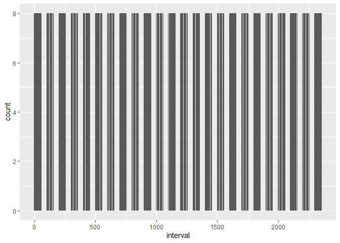
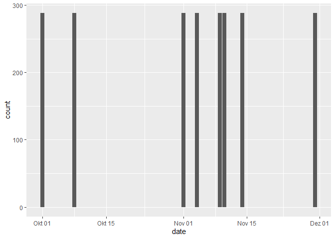
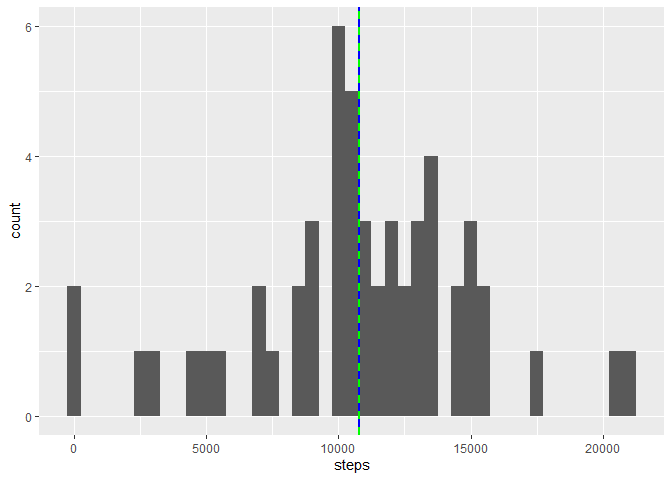
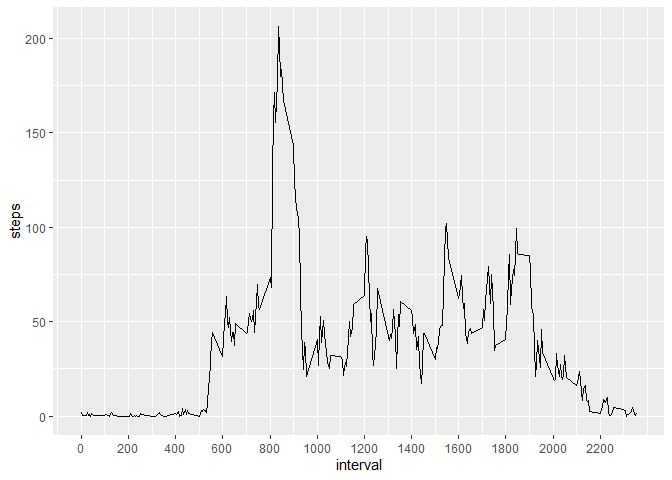
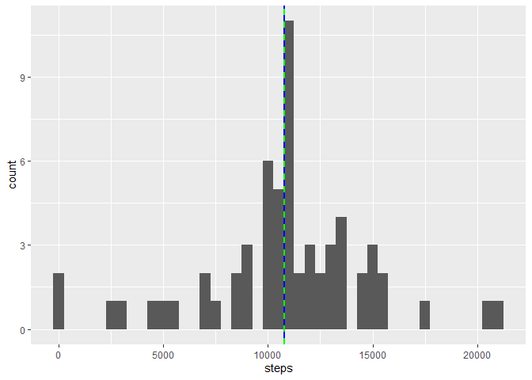
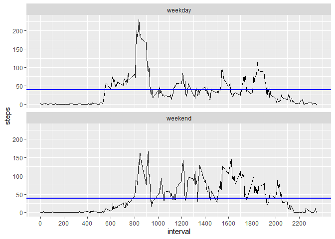

This is my submission for the first assignment of the course "Reproducible Research". As I am communicating the results to fellow data science students who have already solved the same exercise in a similar way (and not to executives or customers or readers of a fancy magazine) I have not spent much time beautfying the plots with titles etc. The data analysis is straight-forward and rather explorative. I hope I have succeeded in my goal to clearly communicate all the steps I performed in my analysis so that my fellow students can understand, reproduce and grade them.


After working through many chapters of Hadley Wickham's book "R for Data Science" (R4DS), I prefer working with the tidyverse libraries which I will first have to load. This will produce some warning messages which you might prefer not to see in a report (message = FALSE / warning = FALSE) but I have deliberately decided not to suppress them so in case you run this in your environment and there is any compatibility problem, you get informed immediately about the cause.


```r
library(tidyverse)
```

```
## Warning: package 'tidyverse' was built under R version 3.6.1
```

```
## -- Attaching packages --------------------------------------- tidyverse 1.2.1 --
```

```
## v ggplot2 3.2.0     v purrr   0.3.2
## v tibble  2.1.3     v dplyr   0.8.3
## v tidyr   0.8.3     v stringr 1.4.0
## v readr   1.3.1     v forcats 0.4.0
```

```
## Warning: package 'tibble' was built under R version 3.6.1
```

```
## Warning: package 'tidyr' was built under R version 3.6.1
```

```
## Warning: package 'readr' was built under R version 3.6.1
```

```
## Warning: package 'dplyr' was built under R version 3.6.1
```

```
## Warning: package 'stringr' was built under R version 3.6.1
```

```
## Warning: package 'forcats' was built under R version 3.6.1
```

```
## -- Conflicts ------------------------------------------ tidyverse_conflicts() --
## x dplyr::filter() masks stats::filter()
## x dplyr::lag()    masks stats::lag()
```

```r
library(chron)
```

```
## Warning: package 'chron' was built under R version 3.6.1
```

## Loading and preprocessing the data

First I define some constants:


```r
input_filename = "activity.csv"
zip_filename = "activity.zip"
```

And then I unzip the data (if not already done before) and read it into memory:


```r
if (!file.exists(input_filename)) { 
    unzip(zip_filename) 
}
activity = read_csv(input_filename, col_types = cols(
    steps = col_integer(),
    date = col_date(),
    interval = col_integer()
  ))
```

A first analysis of the data shows that the steps variable has 13% NA values while the other two columns have no NA values at all:


```r
sum(is.na(activity$steps) == TRUE)
```

```
## [1] 2304
```

```r
mean(is.na(activity$steps) == TRUE)
```

```
## [1] 0.1311475
```

```r
sum(is.na(activity$date) == TRUE)
```

```
## [1] 0
```

```r
sum(is.na(activity$interval) == TRUE)
```

```
## [1] 0
```

My first guess was that the NA values resulted from a lack of activity recording during the night hours, so I checked their distribution over the intervals of the day:


```r
activity %>% filter(is.na(steps)) %>%
    ggplot(aes(x=interval)) + 
    geom_bar()
```



Hmmm... They seem to be distributed evenly over the course of the day, and each interval seems to contain exactly eight NA values. This rather suggests that certain days were not recorded at all:


```r
activity %>% filter(is.na(steps)) %>%
    ggplot(aes(x=date)) + 
    geom_bar()
```


Bingo! Let's find these dates:


```r
unique(filter(activity,is.na(steps))$date)
```

```
## [1] "2012-10-01" "2012-10-08" "2012-11-01" "2012-11-04" "2012-11-09"
## [6] "2012-11-10" "2012-11-14" "2012-11-30"
```

So it's 8 dates without recordings indeed! Let's just filter these dates out as the observations have no value:

```r
na_dates <- unique(filter(activity,is.na(steps))$date)
non_na_activity <- filter(activity, !(date %in% na_dates))
```


## What is mean total number of steps taken per day?
Histogram of the total number of steps taken per day, with vertical lines for the mean and median number of steps taken per day:

```r
daily_activity <- non_na_activity %>% group_by(date) %>% summarize(steps = sum(steps))
ggplot(daily_activity, aes(x=steps)) + 
  geom_histogram(binwidth=500) +
  geom_vline(aes(xintercept=mean(steps)),
            color="blue", size=1) +
  geom_vline(aes(xintercept=median(steps)),
            color="green", linetype="dashed", size=1)
```



The mean and the median seem to be equal:

```r
mean(daily_activity$steps)
```

```
## [1] 10766.19
```

```r
median(daily_activity$steps)
```

```
## [1] 10765
```
They are indeed almost equal.

## What is the average daily activity pattern?
Time series of the average number of steps taken per interval:


```r
avg_activity_per_interval <- non_na_activity %>% group_by(interval) %>% summarize(steps = mean(steps))
ggplot(avg_activity_per_interval, aes(x=interval, y=steps)) + 
  geom_line() + 
  scale_x_continuous(breaks=seq(0, 2300, 200))
```



```r
max(avg_activity_per_interval$steps)
```

```
## [1] 206.1698
```
The peak of a bit more than 200 steps within a five-minute interval is reached shortly after 8 in the morning.


## Imputing missing values
As found out earlier, there are quite some NA values:

```r
sum(is.na(activity$steps) == TRUE)
```

```
## [1] 2304
```
And the NA values comprise 8 whole days:

```r
unique(filter(activity,is.na(steps))$date)
```

```
## [1] "2012-10-01" "2012-10-08" "2012-11-01" "2012-11-04" "2012-11-09"
## [6] "2012-11-10" "2012-11-14" "2012-11-30"
```
So to me the most obvious strategy for filling the missing values seems to be with the mean of all non-missing values of each five-minute interval of all the other days. 


```r
activity[activity$date %in% na_dates, ]$steps <- avg_activity_per_interval$steps
```
Re-creation of the histogram of the total number of steps taken per day, with vertical lines for the mean and median number of steps taken per day:

```r
daily_activity <- activity %>% group_by(date) %>% summarize(steps = sum(steps))
ggplot(daily_activity, aes(x=steps)) + 
  geom_histogram(binwidth=500) +
  geom_vline(aes(xintercept=mean(steps)),
            color="blue", size=1) +
  geom_vline(aes(xintercept=median(steps)),
            color="green", linetype="dashed", size=1)
```



The only difference between this diagram and the one without the imputed values above is the peak at the mean/median: Where there were only 3 values before, with the additional 8 values we have placed at the mean, there are now 11 values in total, more than in any other bin.

Again, the mean and the median seem to equal:

```r
mean(daily_activity$steps)
```

```
## [1] 10766.19
```

```r
median(daily_activity$steps)
```

```
## [1] 10766.19
```
The mean is the same as before, which is to be expected as we have only added values to the data set which correspond exactly to the mean. And the median is exactly equal to the mean now which is also not so surprising: With eight values corresponding to the mean, chances increase that the median is one of them. 

## Are there differences in activity patterns between weekdays and weekends?
First we create a new factor variable in the dataset with two levels – “weekday” and “weekend” indicating whether a given date is a weekday or weekend day, and then we plot the time series of the average number of steps taken per interval again, this time separately for weekdays and weekends:

```r
activity <- mutate(activity, day = as.factor(ifelse(is.weekend(date), "weekend", "weekday")))

avg_activity_per_interval <- activity %>%group_by(day, interval) %>% summarize(steps = mean(steps))
ggplot(avg_activity_per_interval, aes(x=interval, y=steps)) + 
  geom_line() + 
  scale_x_continuous(breaks=seq(0, 2300, 200)) +
  geom_hline(aes(yintercept=mean(steps)), color="blue", size=1) +
  facet_wrap(~ day, ncol = 1)
```



The average number of steps per interval (blue horizontal line) is about the same for weekdays and weekends (around 40), but the distribution is different: Weekdays have a peak shortly after 8 in the morning (presumably when the test person commutes from home to work) and then little movement for the rest of the day, while during weekends, the steps are more spread out over the whole day.
